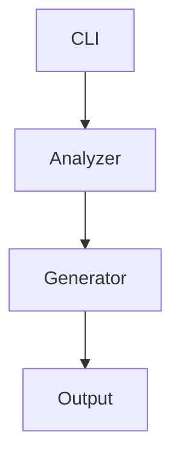

# Design Document: Docly

## Overview

Docly is a command-line tool that automates documentation generation using AI. The system follows a pipeline architecture: CLI input → Project Analysis → AI Content Generation → File Output. The design emphasizes modularity, error resilience, and a delightful user experience through visual feedback.

The core workflow:
1. User invokes CLI command with project path and options
2. Project Analyzer scans codebase and extracts structure
3. Documentation Generator requests content from Gemini AI for 10 documentation types
4. Diagram Generator requests Mermaid syntax and renders to PNG for 14 diagram types
5. File Output Manager saves all generated files to organized directories
6. CLI displays beautiful progress indicators and summaries

**Key Design Principles:**
- **Modularity**: Each component has a single responsibility
- **Resilience**: Graceful error handling with retries and fallbacks for API calls
- **User Experience**: Beautiful CLI with progress indicators and color-coded output
- **Free Tier Optimization**: Efficient API usage to stay within Gemini's free tier limits
- **Extensibility**: Easy to add new documentation types
- **Performance**: Efficient file scanning with .gitignore support and rate limit handling

## Architecture

Docly uses a layered architecture with clear separation of concerns:

```
┌─────────────────────────────────────────────────────────────┐
│                        CLI Layer                            │
│  (Commander.js, Chalk, Ora - User Interface)                │
└─────────────────────────────────────────────────────────────┘
                            ↓
┌─────────────────────────────────────────────────────────────┐
│                   Orchestration Layer                       │
│         (Main Controller - Workflow Coordination)           │
└─────────────────────────────────────────────────────────────┘
                            ↓
        ┌───────────────────┴───────────────────┐
        ↓                                       ↓
┌──────────────────┐                  ┌──────────────────┐
│ Project Analyzer │                  │ Config Manager   │
│  (File Scanner)  │                  │ (Settings)       │
└──────────────────┘                  └──────────────────┘
        ↓
┌─────────────────────────────────────────────────────────────┐
│                    Generation Layer                         │
│  ┌──────────────────────┐                                   │
│  │ Documentation        │                                   │
│  │ Generator            │                                   │
│  │ (Multiple Doc Types) │                                   │
│  └──────────────────────┘                                   │
└─────────────────────────────────────────────────────────────┘
                            ↓
┌─────────────────────────────────────────────────────────────┐
│                   Google Gemini AI Layer                    │
│              (Gemini API Client with Retry Logic)           │
└─────────────────────────────────────────────────────────────┘
                            ↓
┌─────────────────────────────────────────────────────────────┐
│                    File Output Layer                        │
│         (File Writer with Overwrite Protection)             │
└─────────────────────────────────────────────────────────────┘
```

**Architecture Patterns:**
- **Pipeline Pattern**: Sequential processing stages with clear data flow
- **Strategy Pattern**: Pluggable documentation generators
- **Retry Pattern**: Exponential backoff for API failures
- **Observer Pattern**: Progress events for CLI feedback
- **Free Tier Optimization**: Request batching and intelligent caching

## Components and Interfaces

### 1. CLI Layer

**Purpose**: Handle user interaction and command parsing

**Interface**:
```typescript
interface CLIOptions {
  projectPath: string;
  outputDir?: string;
  docTypes?: string[];
  force?: boolean;
  verbose?: boolean;
  config?: string;
  apiKey?: string;
}

class CLI {
  parseArguments(args: string[]): CLIOptions
  displayWelcome(): void
  displayProgress(message: string): void
  displaySuccess(message: string, file: string): void
  displayError(error: Error): void
  displaySummary(stats: GenerationStats): void
}
```

**Dependencies**: Commander.js, Chalk, Ora

**Responsibilities**:
- Parse command-line arguments and validate inputs
- Display welcome banner with version information
- Show progress spinners during long operations
- Display color-coded success/error messages
- Show final summary with file counts and elapsed time

### 2. Configuration Manager

**Purpose**: Load and merge configuration from multiple sources

**Interface**:
```typescript
interface DoclyConfig {
  geminiApiKey: string;
  outputDir: string;
  defaultDocTypes: string[];
  exclusionPatterns: string[];
  maxRetries: number;
  retryDelay: number;
  model: string; // Gemini model version
}

class ConfigManager {
  loadConfig(configPath?: string): DoclyConfig
  mergeConfigs(cli: CLIOptions, file: Partial<DoclyConfig>): DoclyConfig
  validateConfig(config: DoclyConfig): ValidationResult
}
```

**Configuration Priority** (highest to lowest):
1. Command-line arguments
2. .doclyrc file in project root
3. Environment variables (GEMINI_API_KEY)
4. Default values

**Default Configuration**:
```typescript
{
  outputDir: './docs',
  defaultDocTypes: ['README', 'API', 'SETUP', 'CONTRIBUTING'],
  exclusionPatterns: ['node_modules/**', 'dist/**', 'build/**', '.git/**'],
  maxRetries: 3,
  retryDelay: 1000,
  model: 'gemini-2.0-flash-exp' // Free tier model
}
```

### 3. Project Analyzer

**Purpose**: Scan codebase and extract structural information

**Interface**:
```typescript
interface FileInfo {
  path: string;
  type: string;
  language: string;
  size: number;
  content?: string;
}

interface ProjectStructure {
  projectType: string;
  rootPath: string;
  files: FileInfo[];
  directories: string[];
  dependencies: Record<string, string>;
  entryPoints: string[];
  configFiles: string[];
  packageInfo?: PackageInfo;
}

interface PackageInfo {
  name?: string;
  version?: string;
  description?: string;
  author?: string;
  license?: string;
}

class ProjectAnalyzer {
  analyzeProject(projectPath: string, exclusions: string[]): ProjectStructure
  scanDirectory(dirPath: string, exclusions: string[]): FileInfo[]
  detectProjectType(files: FileInfo[]): string
  extractDependencies(files: FileInfo[]): Record<string, string>
  identifyEntryPoints(files: FileInfo[]): string[]
  extractPackageInfo(files: FileInfo[]): PackageInfo | undefined
  shouldExclude(filePath: string, patterns: string[]): boolean
}
```

**Analysis Strategy**:
1. Read .gitignore and merge with configured exclusion patterns
2. Recursively scan directory tree
3. Identify file types by extension
4. Detect project type from config files (package.json, requirements.txt, pom.xml, etc.)
5. Extract dependencies from config files
6. Extract package/project metadata
7. Identify entry points (main.js, index.ts, app.py, etc.)
8. For key files, read content for deeper analysis

**Project Type Detection**:
- Node.js: package.json present
- Python: requirements.txt, setup.py, or pyproject.toml present
- Java: pom.xml or build.gradle present
- Go: go.mod present
- Rust: Cargo.toml present
- PHP: composer.json present
- Ruby: Gemfile present
- .NET: *.csproj or *.sln present
- Generic: fallback if no specific markers found

### 4. Documentation Generator

**Purpose**: Generate multiple types of markdown documentation using Google Gemini AI

**Interface**:
```typescript
type DocType = 
  | 'README'
  | 'API'
  | 'SETUP'
  | 'CONTRIBUTING'
  | 'ARCHITECTURE'
  | 'DEPLOYMENT'
  | 'TESTING'
  | 'CHANGELOG'
  | 'FAQ'
  | 'SECURITY';

interface DocumentationRequest {
  docType: DocType;
  projectStructure: ProjectStructure;
  existingDocs?: string[];
}

interface DocumentationResult {
  docType: DocType;
  content: string;
  fileName: string;
  success: boolean;
  error?: Error;
}

class DocumentationGenerator {
  generateDocumentation(
    request: DocumentationRequest,
    geminiClient: GeminiClient
  ): Promise<DocumentationResult>
  
  buildPrompt(docType: DocType, structure: ProjectStructure): string
  validateMarkdown(content: string): boolean
  formatDocument(content: string, docType: DocType): string
}
```

**Documentation Type Templates**:

Each documentation type has a specific prompt template that guides Gemini AI:

1. **README.md**: Project overview, installation, usage, features, examples
2. **SRS.md**: Requirements specification with functional/non-functional requirements
3. **ARCHITECTURE.md**: System design, components, data flow, technology stack
4. **API_DOCS.md**: Endpoints, request/response formats, authentication, examples
5. **CONTRIBUTING.md**: Development setup, coding standards, PR process
6. **CHANGELOG.md**: Version history, breaking changes, new features
7. **TESTING.md**: Test strategy, test types, running tests, coverage
8. **DEPLOYMENT.md**: Deployment steps, environment setup, CI/CD
9. **SECURITY.md**: Security policies, vulnerability reporting, best practices
10. **FAQ.md**: Common questions, troubleshooting, tips

**Generation Strategy**:
- Process documentation types sequentially to avoid rate limiting
- Include project structure context in each prompt
- Request specific sections based on documentation type
- Validate markdown syntax before returning
- Add metadata headers (generated date, tool version)

### 5. Diagram Generator

**Purpose**: Generate 14 types of visual diagrams using Mermaid.js

**Interface**:
```typescript
type DiagramType =
  | 'ARCHITECTURE'
  | 'COMPONENT'
  | 'ER'
  | 'SEQUENCE'
  | 'ACTIVITY'
  | 'CLASS'
  | 'STATE'
  | 'USE_CASE'
  | 'FLOWCHART'
  | 'WORKFLOW'
  | 'DFD'
  | 'DEPLOYMENT'
  | 'NETWORK'
  | 'GANTT';

interface DiagramRequest {
  diagramType: DiagramType;
  projectStructure: ProjectStructure;
}

interface DiagramResult {
  diagramType: DiagramType;
  mermaidSyntax: string;
  fileName: string;
  success: boolean;
  error?: Error;
}

class DiagramGenerator {
  generateDiagram(
    request: DiagramRequest,
    aiClient: GeminiClient
  ): Promise<DiagramResult>
  
  buildDiagramPrompt(type: DiagramType, structure: ProjectStructure): string
  validateMermaidSyntax(syntax: string): boolean
}
```

**Diagram Type Descriptions**:

1. **Architecture**: High-level system components and their relationships
2. **Component**: Module structure and dependencies
3. **ER (Entity-Relationship)**: Database schema and relationships
4. **Sequence**: Interaction flows between components over time
5. **Activity**: Process flows and decision points
6. **Class**: Object-oriented class structure and inheritance
7. **State**: State machines and transitions
8. **Use Case**: User interactions and system boundaries
9. **Flowchart**: Logic flow and decision trees
10. **Workflow**: Business process flows
11. **DFD (Data Flow Diagram)**: Data movement through the system
12. **Deployment**: Infrastructure and deployment topology
13. **Network**: Network architecture and connections
14. **Gantt**: Project timeline and milestones

**Mermaid Syntax Examples**:



### 6. Google Gemini AI Client

**Purpose**: Interface with Google's Gemini API for content generation

**Interface**:
```typescript
interface GeminiConfig {
  apiKey: string;
  model: string;
  maxRetries: number;
  retryDelay: number;
}

interface GenerationParams {
  prompt: string;
  temperature?: number;
  maxTokens?: number;
  topP?: number;
  topK?: number;
}

interface GenerationResult {
  content: string;
  tokensUsed: number;
  model: string;
  finishReason: string;
}

class GeminiClient {
  constructor(config: GeminiConfig)
  
  async generateContent(params: GenerationParams): Promise<GenerationResult>
  async generateWithRetry(params: GenerationParams): Promise<GenerationResult>
  validateApiKey(): Promise<boolean>
  getRemainingQuota(): Promise<QuotaInfo>
}
```

**Retry Strategy**:
- Initial delay: 1 second
- Backoff multiplier: 2x
- Max delay: 30 seconds
- Max attempts: 3

**Error Handling**:
- 401 Unauthorized: Invalid API key → fail immediately
- 429 Rate Limit: Wait for retry-after header → retry
- 500 Server Error: Exponential backoff → retry
- Network Error: Exponential backoff → retry
- Timeout: Exponential backoff → retry

**Rate Limiting**:
- Respect rate limit headers from API
- Sequential processing of requests to avoid hitting limits
- Configurable delay between requests

**Free Tier Optimization**:

Gemini API free tier limits (as of 2024):
- 15 requests per minute (RPM)
- 1 million tokens per minute (TPM)
- 1,500 requests per day (RPD)

**Optimization Strategies**:
1. Request queuing to stay under 15 RPM
2. Token usage tracking and optimization
3. Efficient prompts to minimize token consumption
4. Caching frequently generated content
5. Batching similar requests when possible


### 7. Mermaid Renderer

**Purpose**: Convert Mermaid.js syntax to PNG images

**Interface**:
```typescript
interface RenderOptions {
  theme: 'default' | 'neutral' | 'dark' | 'forest';
  backgroundColor: string;
  width: number;
  height: number;
  scale: number;
}

interface RenderResult {
  success: boolean;
  outputPath: string;
  error?: Error;
}

class MermaidRenderer {
  constructor(options: RenderOptions)
  
  renderToPNG(mermaidSyntax: string, outputPath: string): Promise<RenderResult>
  validateSyntax(syntax: string): boolean
  optimizeImage(imagePath: string): Promise<void>
}
```

**Rendering Process**:
1. Validate Mermaid syntax using mermaid-cli
2. Create temporary HTML file with Mermaid content
3. Use Puppeteer/Playwright to render in headless browser
4. Capture screenshot as PNG
5. Optimize PNG file size
6. Clean up temporary files

**Rendering Options**:
- Theme: neutral (default), dark, forest, default
- Background: transparent (default) or custom color
- Resolution: 1920x1080 (default) or custom
- Scale: 1 (default) for retina displays

### 8. File Output Manager

**Purpose**: Save generated files with overwrite protection

**Interface**:
```typescript
interface OutputOptions {
  outputDir: string;
  force: boolean;
  createDirs: boolean;
}

interface WriteResult {
  filePath: string;
  success: boolean;
  skipped: boolean;
  error?: Error;
}

class FileOutputManager {
  constructor(options: OutputOptions)
  
  writeDocumentation(doc: DocumentationResult): Promise<WriteResult>
  writeDiagram(diagram: DiagramResult, pngData: Buffer): Promise<WriteResult>
  checkOverwrite(filePath: string): Promise<boolean>
  ensureDirectory(dirPath: string): Promise<void>
  cleanupPartialFiles(files: string[]): Promise<void>
}
```

**Output Structure**:
```
docs/
├── README.md
├── SRS.md
├── ARCHITECTURE.md
├── API_DOCS.md
├── CONTRIBUTING.md
├── CHANGELOG.md
├── TESTING.md
├── DEPLOYMENT.md
├── SECURITY.md
├── FAQ.md
└── diagrams/
    ├── architecture.png
    ├── component.png
    ├── er-diagram.png
    ├── sequence.png
    ├── activity.png
    ├── class.png
    ├── state.png
    ├── use-case.png
    ├── flowchart.png
    ├── workflow.png
    ├── dfd.png
    ├── deployment.png
    ├── network.png
    └── gantt.png
```

**File Writing Strategy**:
- Check if file exists before writing
- Prompt user for confirmation unless --force flag is set
- Create parent directories automatically
- Use atomic writes (write to temp file, then rename)
- Clean up partial files on error unless --debug flag is set

### 9. Main Orchestrator

**Purpose**: Coordinate the entire generation workflow

**Interface**:
```typescript
interface GenerationStats {
  docsGenerated: number;
  diagramsGenerated: number;
  errors: number;
  duration: number;
  files: string[];
}

class Orchestrator {
  constructor(
    config: DoclyConfig,
    cli: CLI,
    analyzer: ProjectAnalyzer,
    docGen: DocumentationGenerator,
    diagramGen: DiagramGenerator,
    renderer: MermaidRenderer,
    output: FileOutputManager
  )
  
  async run(): Promise<GenerationStats>
  
  private async analyzePhase(): Promise<ProjectStructure>
  private async documentationPhase(structure: ProjectStructure): Promise<DocumentationResult[]>
  private async diagramPhase(structure: ProjectStructure): Promise<DiagramResult[]>
  private async renderPhase(diagrams: DiagramResult[]): Promise<RenderResult[]>
  private async outputPhase(docs: DocumentationResult[], diagrams: RenderResult[]): Promise<WriteResult[]>
}
```

**Workflow Steps**:

1. **Initialization**
   - Load configuration
   - Validate API key
   - Display welcome banner

2. **Analysis Phase**
   - Scan project directory
   - Extract structure
   - Display progress

3. **Documentation Phase**
   - For each requested doc type:
     - Build prompt with context
     - Request content from Gemini AI
     - Validate markdown
     - Display success/error

4. **Diagram Phase**
   - For each requested diagram type:
     - Build diagram prompt
     - Request Mermaid syntax from Gemini AI
     - Validate syntax
     - Display success/error

5. **Rendering Phase**
   - For each diagram:
     - Render Mermaid to PNG
     - Optimize image
     - Display success/error

6. **Output Phase**
   - Create output directories
   - Write documentation files
   - Write diagram files
   - Display file paths

7. **Summary**
   - Display statistics
   - Show elapsed time
   - List all generated files


## Data Models

### ProjectStructure

```typescript
interface ProjectStructure {
  // Basic project info
  projectType: string;           // 'nodejs', 'python', 'java', etc.
  rootPath: string;              // Absolute path to project root
  projectName: string;           // Derived from directory name or package.json
  
  // File information
  files: FileInfo[];             // All scanned files
  directories: string[];         // All directories
  totalFiles: number;            // Count of files
  totalSize: number;             // Total size in bytes
  
  // Dependencies
  dependencies: Record<string, string>;     // Production dependencies
  devDependencies: Record<string, string>;  // Development dependencies
  
  // Entry points and structure
  entryPoints: string[];         // Main entry files
  configFiles: string[];         // Configuration files
  testFiles: string[];           // Test files
  
  // Code analysis
  languages: Record<string, number>;  // Language -> file count
  frameworks: string[];          // Detected frameworks
  
  // Metadata
  analyzedAt: Date;
  version?: string;              // From package.json or similar
}

interface FileInfo {
  path: string;                  // Relative path from root
  absolutePath: string;          // Absolute file path
  type: FileType;                // 'source', 'config', 'test', 'doc', 'other'
  language: string;              // 'typescript', 'python', 'java', etc.
  extension: string;             // File extension
  size: number;                  // File size in bytes
  lines?: number;                // Line count (for source files)
  content?: string;              // File content (for key files only)
  imports?: string[];            // Imported modules (for source files)
  exports?: string[];            // Exported symbols (for source files)
}

type FileType = 'source' | 'config' | 'test' | 'doc' | 'other';
```

### Configuration Model

```typescript
interface DoclyConfig {
  // API Configuration
  apiKey: string;                // Gemini API key
  apiEndpoint?: string;          // Custom API endpoint
  
  // Output Configuration
  outputDir: string;             // Output directory path
  diagramsSubdir: string;        // Subdirectory for diagrams
  
  // Generation Options
  defaultDocTypes: DocType[];    // Default documentation types
  defaultDiagramTypes: DiagramType[];  // Default diagram types
  
  // Exclusion Patterns
  exclusionPatterns: string[];   // Glob patterns to exclude
  respectGitignore: boolean;     // Whether to use .gitignore
  
  // Mermaid Configuration
  mermaidTheme: string;          // Mermaid theme
  mermaidResolution: {
    width: number;
    height: number;
  };
  mermaidBackground: string;     // Background color
  
  // Retry Configuration
  retryAttempts: number;         // Max retry attempts
  retryDelay: number;            // Initial retry delay (ms)
  retryBackoff: number;          // Backoff multiplier
  
  // Behavior Options
  force: boolean;                // Overwrite without prompting
  verbose: boolean;              // Verbose logging
  debug: boolean;                // Debug mode (keep temp files)
  parallel: boolean;             // Parallel generation (future)
}
```

### Generation Results

```typescript
interface GenerationStats {
  // Counts
  docsGenerated: number;
  docsRequested: number;
  diagramsGenerated: number;
  diagramsRequested: number;
  errors: number;
  
  // Timing
  startTime: Date;
  endTime: Date;
  duration: number;              // Milliseconds
  
  // Files
  files: GeneratedFile[];
  
  // Errors
  errorDetails: GenerationError[];
}

interface GeneratedFile {
  type: 'documentation' | 'diagram';
  name: string;
  path: string;
  size: number;
  success: boolean;
}

interface GenerationError {
  phase: 'analysis' | 'documentation' | 'diagram' | 'rendering' | 'output';
  type: string;
  message: string;
  details?: any;
}
```

## Error Handling

### Error Categories

**1. User Input Errors**
- Invalid project path
- Invalid documentation or diagram types
- Invalid configuration values
- Missing required parameters

**Strategy**: Validate early, fail fast with clear error messages and usage examples.

**2. File System Errors**
- Permission denied
- Disk full
- Path too long
- File locked by another process

**Strategy**: Display specific error with file path, suggest solutions (check permissions, free space).

**3. Network Errors**
- No internet connection
- DNS resolution failure
- Connection timeout
- SSL/TLS errors

**Strategy**: Detect network issues early, display clear message, suggest checking connection.

**4. API Errors**
- Invalid API key (401)
- Rate limit exceeded (429)
- Server error (500)
- Service unavailable (503)

**Strategy**: Implement retry with exponential backoff, respect rate limit headers, provide clear error messages with API key setup instructions.

**5. Rendering Errors**
- Invalid Mermaid syntax
- Rendering timeout
- Memory exhaustion
- Browser launch failure

**Strategy**: Validate syntax before rendering, log errors but continue with other diagrams, provide fallback options.

**6. Content Validation Errors**
- Invalid markdown format
- Missing required sections
- Malformed AI response

**Strategy**: Validate AI responses, retry on validation failure, log issues for debugging.

### Error Recovery Strategies

**Retry with Exponential Backoff**:
```typescript
async function retryWithBackoff<T>(
  fn: () => Promise<T>,
  maxAttempts: number = 3,
  initialDelay: number = 1000
): Promise<T> {
  let lastError: Error;
  
  for (let attempt = 1; attempt <= maxAttempts; attempt++) {
    try {
      return await fn();
    } catch (error) {
      lastError = error;
      
      if (attempt < maxAttempts) {
        const delay = initialDelay * Math.pow(2, attempt - 1);
        await sleep(delay);
      }
    }
  }
  
  throw lastError;
}
```

**Graceful Degradation**:
- If diagram rendering fails, continue with documentation generation
- If one documentation type fails, continue with others
- Collect all errors and display summary at the end

**Cleanup on Failure**:
- Track all created files during generation
- On error, remove partial files unless debug mode is enabled
- Ensure no corrupted files are left behind

**User-Friendly Error Messages**:
```typescript
interface ErrorMessage {
  title: string;           // Short error description
  details: string;         // Detailed explanation
  suggestion: string;      // How to fix
  code?: string;          // Error code for reference
}

// Example:
{
  title: "Invalid API Key",
  details: "The Gemini API key is missing or invalid.",
  suggestion: "Set your API key using: export GEMINI_API_KEY='your-key-here'",
  code: "ERR_INVALID_API_KEY"
}
```

### Error Logging

**Log Levels**:
- ERROR: Critical failures that stop execution
- WARN: Non-critical issues (e.g., skipped diagram)
- INFO: Normal operation messages
- DEBUG: Detailed diagnostic information

**Log Output**:
- Console: User-friendly messages with colors
- File: Detailed logs in .docly/logs/ (when verbose mode enabled)
- Include timestamps, error codes, stack traces (debug mode)

## Testing Strategy

### Dual Testing Approach

Docly requires both unit tests and property-based tests for comprehensive coverage:

**Unit Tests**: Focus on specific examples, edge cases, and integration points
- Test specific file type detection (package.json → Node.js)
- Test error messages for known error conditions
- Test CLI output formatting
- Test configuration file parsing with specific examples
- Test Mermaid syntax validation with known valid/invalid examples

**Property-Based Tests**: Verify universal properties across all inputs
- Test that all valid CLI parameter combinations work
- Test that file scanning visits all directories
- Test that exclusion patterns correctly filter files
- Test that retry logic always respects exponential backoff
- Test that configuration precedence is always correct

### Property-Based Testing Configuration

**Testing Library**: Use `fast-check` for JavaScript/TypeScript property-based testing

**Test Configuration**:
- Minimum 100 iterations per property test
- Each test tagged with feature name and property number
- Tag format: `Feature: docly, Property {N}: {property description}`

**Example Property Test**:
```typescript
import fc from 'fast-check';

// Feature: docly, Property 8: Gitignore exclusion patterns are respected
test('gitignore patterns exclude matching files', () => {
  fc.assert(
    fc.property(
      fc.array(fc.string()),  // Generate random file paths
      fc.array(fc.string()),  // Generate random gitignore patterns
      (files, patterns) => {
        const analyzer = new ProjectAnalyzer();
        const result = analyzer.filterByGitignore(files, patterns);
        
        // Verify no excluded files in result
        result.forEach(file => {
          patterns.forEach(pattern => {
            expect(file).not.toMatch(pattern);
          });
        });
      }
    ),
    { numRuns: 100 }
  );
});
```

### Test Coverage Areas

**1. CLI Layer Tests**
- Argument parsing with various input combinations
- Error message formatting
- Progress indicator display
- Summary generation

**2. Project Analyzer Tests**
- Directory scanning with various structures
- File type detection across languages
- Gitignore pattern matching
- Project type detection
- Dependency extraction

**3. Documentation Generator Tests**
- Prompt building for each doc type
- Markdown validation
- Retry logic with mocked failures
- Sequential processing verification

**4. Diagram Generator Tests**
- Mermaid syntax generation for each diagram type
- Syntax validation
- Error handling for invalid syntax

**5. Mermaid Renderer Tests**
- PNG generation from valid syntax
- Resolution and theme configuration
- Transparent background support
- Error handling for rendering failures

**6. File Output Manager Tests**
- Directory creation
- File writing with various paths
- Overwrite protection
- Cleanup on error

**7. Configuration Manager Tests**
- Config file loading
- Environment variable reading
- Configuration merging
- Precedence order

**8. Integration Tests**
- End-to-end generation workflow
- Error recovery scenarios
- Multiple documentation types
- Multiple diagram types

### Test Data Generators

For property-based testing, create generators for:

**File Structure Generator**:
```typescript
const fileStructureArb = fc.record({
  files: fc.array(fc.record({
    path: fc.string(),
    type: fc.constantFrom('source', 'config', 'test', 'doc'),
    language: fc.constantFrom('typescript', 'python', 'java', 'go'),
  })),
  directories: fc.array(fc.string()),
});
```

**CLI Options Generator**:
```typescript
const cliOptionsArb = fc.record({
  projectPath: fc.string(),
  docTypes: fc.array(fc.constantFrom(...DOC_TYPES)),
  diagramTypes: fc.array(fc.constantFrom(...DIAGRAM_TYPES)),
  outputDir: fc.string(),
  force: fc.boolean(),
});
```

**Gitignore Pattern Generator**:
```typescript
const gitignorePatternArb = fc.oneof(
  fc.string().map(s => `${s}/**`),  // Directory patterns
  fc.string().map(s => `*.${s}`),   // Extension patterns
  fc.string(),                       // Exact matches
);
```

### Performance Testing

While not part of unit/property tests, consider:
- Benchmark large project scanning (10,000+ files)
- Measure API request timing and rate limiting
- Test memory usage with large codebases
- Verify rendering performance for complex diagrams

### Continuous Integration

**Test Execution**:
- Run all tests on every commit
- Separate fast unit tests from slower integration tests
- Run property tests with reduced iterations in CI (50 runs)
- Full property test suite (100+ runs) on release branches

**Coverage Goals**:
- Minimum 80% code coverage
- 100% coverage for critical paths (CLI parsing, error handling)
- All correctness properties must have corresponding tests


## Implementation Notes

### Technology Stack Justification

**Node.js Runtime**:
- Excellent ecosystem for CLI tools
- Native async/await support for API calls
- Cross-platform compatibility
- Rich package ecosystem

**Commander.js**:
- Industry standard for Node.js CLI applications
- Clean API for argument parsing
- Built-in help generation
- Subcommand support for future extensibility

**Google Gemini AI**:
- State-of-the-art code understanding
- Large context window for analyzing entire projects
- Competitive pricing
- Good documentation and API stability

**Mermaid.js**:
- Widely adopted diagram syntax
- Supports all required diagram types
- Text-based (easy to generate with AI)
- PNG rendering via puppeteer/playwright

**Chalk & Ora**:
- Beautiful terminal output
- Cross-platform color support
- Smooth spinner animations
- Minimal dependencies

### Key Implementation Considerations

**1. API Rate Limiting**:
- Gemini API has rate limits (requests per minute)
- Sequential processing prevents hitting limits
- Exponential backoff for 429 responses
- Consider adding configurable delay between requests

**2. Large Codebase Handling**:
- Don't send entire file contents to AI
- Send file structure + key files only
- Implement smart file selection (entry points, configs)
- Consider token limits when building prompts

**3. Mermaid Rendering**:
- Requires headless browser (Puppeteer/Playwright)
- Can be slow for complex diagrams
- Consider caching rendered diagrams
- Provide option to skip rendering (output Mermaid syntax only)

**4. Configuration Management**:
- Support multiple config formats (.doclyrc, .doclyrc.json, .doclyrc.js)
- Validate config schema on load
- Provide clear error messages for invalid config
- Document all configuration options

**5. Error Recovery**:
- Always clean up temp files
- Provide --debug flag to keep temp files for troubleshooting
- Log all errors to file in verbose mode
- Display actionable error messages

**6. Extensibility**:
- Design for easy addition of new doc types
- Design for easy addition of new diagram types
- Consider plugin system for custom generators
- Allow custom prompt templates

### File Structure

```
docly/
├── src/
│   ├── cli/
│   │   ├── index.ts              # CLI entry point
│   │   ├── commands.ts           # Command definitions
│   │   └── ui.ts                 # UI components (spinners, colors)
│   ├── core/
│   │   ├── orchestrator.ts       # Main workflow coordinator
│   │   ├── config.ts             # Configuration manager
│   │   └── types.ts              # Shared type definitions
│   ├── analyzer/
│   │   ├── project-analyzer.ts   # Project scanning
│   │   ├── file-scanner.ts       # File system operations
│   │   └── language-detector.ts  # Language/type detection
│   ├── generators/
│   │   ├── documentation-generator.ts  # Doc generation
│   │   ├── diagram-generator.ts        # Diagram generation
│   │   └── templates/                  # Prompt templates
│   │       ├── docs/
│   │       │   ├── readme.ts
│   │       │   ├── srs.ts
│   │       │   └── ...
│   │       └── diagrams/
│   │           ├── architecture.ts
│   │           ├── sequence.ts
│   │           └── ...
│   ├── ai/
│   │   ├── gemini-client.ts      # Gemini API client
│   │   ├── retry.ts              # Retry logic
│   │   └── rate-limiter.ts       # Rate limiting
│   ├── renderer/
│   │   ├── mermaid-renderer.ts   # Mermaid to PNG
│   │   └── validator.ts          # Syntax validation
│   ├── output/
│   │   ├── file-writer.ts        # File operations
│   │   └── cleanup.ts            # Error cleanup
│   └── utils/
│       ├── logger.ts             # Logging utilities
│       ├── errors.ts             # Error types
│       └── validators.ts         # Input validation
├── tests/
│   ├── unit/                     # Unit tests
│   ├── property/                 # Property-based tests
│   ├── integration/              # Integration tests
│   └── fixtures/                 # Test data
├── docs/                         # Generated documentation
├── .doclyrc.example              # Example config
├── package.json
├── tsconfig.json
└── README.md
```

### Prompt Engineering Guidelines

**Documentation Prompts**:
- Include project structure summary
- Specify documentation type and expected sections
- Provide examples of good documentation
- Request specific format (markdown with headers)
- Include project metadata (name, type, dependencies)

**Example Documentation Prompt**:
```
Generate a comprehensive README.md for the following project:

Project Type: Node.js
Project Name: my-app
Dependencies: express, typescript, jest

Project Structure:
- src/
  - index.ts (entry point)
  - routes/
  - models/
  - controllers/
- tests/
- package.json

Please include the following sections:
1. Project Title and Description
2. Features
3. Installation Instructions
4. Usage Examples
5. API Documentation (if applicable)
6. Testing
7. Contributing
8. License

Format the output as valid markdown with proper headers and code blocks.
```

**Diagram Prompts**:
- Specify diagram type clearly
- Request Mermaid.js syntax explicitly
- Provide context about system architecture
- Request appropriate level of detail
- Specify diagram orientation if needed

**Example Diagram Prompt**:
```
Generate a Mermaid.js architecture diagram for the following system:

Project Type: Node.js API
Components:
- Express API Server
- PostgreSQL Database
- Redis Cache
- External Payment API

Please create a Mermaid.js graph showing:
1. All major components
2. Data flow between components
3. External dependencies

Output only valid Mermaid.js syntax (graph TD format).
```


## Security Considerations

### 1. API Key Management

**Best Practices**:
- Never commit API keys to version control
- Use environment variables for API keys
- Support .env files for local development
- Warn users if API key is in config file
- Consider using system keychain for storage (future feature)

**Configuration Priority**:
1. Environment variable `GEMINI_API_KEY`
2. .env file (gitignored)
3. .doclyrc file (with warning)

**Example .env file**:
```bash
GEMINI_API_KEY=your_api_key_here
DOCLY_OUTPUT_DIR=./docs
DOCLY_LOG_LEVEL=info
```

### 2. File System Security

- Validate all file paths
- Prevent directory traversal attacks
- Respect file permissions
- Don't follow symlinks outside project directory


### 3. AI-Generated Content Security
- Sanitize AI responses before writing to files
- Validate markdown doesn't contain malicious content
- Limit file sizes to prevent disk exhaustion
- Validate Mermaid syntax to prevent injection

### 4. Network Security

- Use HTTPS for all API calls
- Validate SSL certificates
- Set reasonable timeouts
- Don't expose sensitive project data in prompts

**HTTPS Enforcement**:
All API calls to Gemini use HTTPS by default.

**Request Timeouts**:
```typescript
const TIMEOUT_MS = 30000; // 30 seconds

async function makeAPIRequest(url: string, options: any): Promise<Response> {
  const controller = new AbortController();
  const timeout = setTimeout(() => controller.abort(), TIMEOUT_MS);
  
  try {
    const response = await fetch(url, {
      ...options,
      signal: controller.signal
    });
    return response;
  } finally {
    clearTimeout(timeout);
  }
}
```

### 5. Data Privacy

**No Sensitive Data in Prompts**:
- Exclude files with sensitive patterns (.env, .pem, .key)
- Filter out credential files before analysis
- Redact API keys and tokens from code samples
- Don't include full file contents in prompts


## Performance Optimization

**Caching**:
- Cache project analysis results
- Cache AI responses for identical prompts
- Cache rendered diagrams
- Implement cache invalidation strategy

**Parallel Processing**:
- Current design is sequential (avoid rate limits)
- Future: support parallel generation with rate limiting
- Render multiple diagrams in parallel
- Parallel file writing

**Memory Management**:
- Stream large files instead of loading entirely
- Limit number of files analyzed in detail
- Clean up temp files immediately after use
- Monitor memory usage for large projects

**Incremental Generation**:
- Support regenerating specific doc types only
- Skip unchanged files (compare timestamps)
- Implement smart caching based on project changes


## Future Enhancements

### Phase 1: Core Improvements 

1. **Additional Documentation Types**:
   - User Manual
   - Troubleshooting Guide
   - Performance Guide
   - Migration Guide

2. **Enhanced Analysis**:
   - Code complexity metrics
   - Dependency vulnerability scanning
   - Code quality indicators
   - Test coverage integration

3. **Improved Prompts**:
   - Context-aware prompting
   - Project-specific customization
   - User feedback integration
   - Prompt template library

4. **Better Error Handling**:
   - More detailed error messages
   - Recovery suggestions
   - Automatic retry with backoff
   - Partial generation recovery

### Phase 2: Advanced Features

1. **Watch Mode**:
   - Regenerate on file changes
   - Incremental updates
   - Real-time preview
   - Change detection

2. **Interactive Mode**:
   - Ask clarifying questions
   - User-guided generation
   - Template customization
   - Preview before saving

3. **Custom Templates**:
   - User-defined templates
   - Template marketplace
   - Template variables
   - Template validation

4. **Multi-Language Support**:
   - Generate docs in multiple languages
   - Translation management
   - Language-specific formats
   - RTL language support

5. **Git Integration**:
   - Generate CHANGELOG from commits
   - Version-based documentation
   - Commit message analysis
   - Release notes generation

### Phase 3: Enterprise Features

1. **Team Collaboration**:
   - Shared templates
   - Review workflow
   - Approval process
   - Version control integration

2. **Web Dashboard**:
   - Browser-based interface
   - Real-time collaboration
   - Documentation preview
   - Analytics dashboard

3. **AWS Integration**:
   - Amazon Bedrock support
   - S3 storage integration
   - Lambda serverless deployment
   - CloudWatch monitoring

4. **CI/CD Integration**:
   - GitHub Actions
   - GitLab CI
   - Jenkins plugin
   - Azure DevOps

5. **Analytics**:
   - Documentation coverage
   - Quality metrics
   - Usage statistics
   - Improvement suggestions

### Potential Integrations

1. **Version Control Platforms**:
   - GitHub: Auto-generate docs on PR
   - GitLab: Merge request documentation
   - Bitbucket: Pull request docs

2. **Documentation Platforms**:
   - Confluence export
   - Notion integration
   - Read the Docs
   - GitBook

3. **Development Tools**:
   - VS Code extension
   - JetBrains plugin
   - Vim plugin
   - Emacs mode

4. **Communication Platforms**:
   - Slack notifications
   - Discord integration
   - Teams webhook
   - Email notifications

## AWS Hack2skill AI for Bharat Hackathon Integration

### Hackathon-Specific Features

**1. AWS Integration (Potential Extensions)**:
While the current implementation uses Google Gemini API, the architecture supports future AWS integrations:
- AWS Bedrock for alternative AI models
- Amazon S3 for documentation storage
- AWS Lambda for serverless deployment
- Amazon CloudWatch for monitoring

**2. Free Tier Focus**:
- Designed to work entirely within free tier limits
- No paid services required
- Optimized API usage for cost-effectiveness
- Educational focus for students and small teams

### Deployment Strategy

**NPM Package**:
- Publish as `@docly/cli` or `docly-cli`
- Include pre-built binaries for major platforms
- Semantic versioning
- Changelog generation

**Installation Methods**:
```bash
# NPM
npm install -g docly-cli

# Yarn
yarn global add docly-cli

# NPX (no install)
npx docly-cli generate ./my-project

# Homebrew (future)
brew install docly
```

**Binary Distribution**:
- Use `pkg` or `nexe` to create standalone binaries
- Support Windows, macOS, Linux
- Include all dependencies
- Auto-update mechanism

### Monitoring and Analytics

**Usage Metrics** (opt-in):
- Number of projects analyzed
- Documentation types generated
- Diagram types generated
- Error rates by type
- Performance metrics

**Error Reporting**:
- Optional error reporting to service (Sentry)
- Include error context (not sensitive data)
- Help improve error messages
- Track common failure patterns

## Documentation Requirements

### User Documentation

1. **README.md**: Project overview and quick start
2. **SETUP.md**: Detailed installation guide
3. **API.md**: CLI command reference
4. **CONFIGURATION.md**: Configuration options
5. **TROUBLESHOOTING.md**: Common issues and solutions
6. **FAQ.md**: Frequently asked questions
7. **EXAMPLES.md**: Usage examples and tutorials

### Developer Documentation

1. **ARCHITECTURE.md**: System architecture
2. **CONTRIBUTING.md**: Contribution guidelines
3. **DEVELOPMENT.md**: Development setup
4. **TESTING.md**: Testing guide
5. **RELEASE.md**: Release process

## Conclusion

Docly represents a modern approach to documentation generation, leveraging Google's free Gemini AI API to help developers create comprehensive documentation for their projects. Built for the AWS Hack2skill AI for Bharat hackathon, it demonstrates:

1. **Practical AI Application**: Solving a real developer pain point
2. **Free Tier Optimization**: Accessible to students and small teams
3. **Developer-Friendly**: CLI-first approach fitting into existing workflows
4. **Extensible Architecture**: Easy to add new features and integrations
5. **AWS Ready**: Architecture supports future AWS integrations

The modular design ensures that Docly can evolve with user needs, from a simple CLI tool to a comprehensive documentation platform serving teams and enterprises.

**Key Metrics for Success**:
- Number of projects documented
- User satisfaction with generated docs
- Time saved compared to manual documentation
- Adoption in open source projects
- Community contributions and extensions

**Impact Areas**:
- Individual developers: Quick project documentation
- Small teams: Consistent documentation standards
- Open source: Lowering contributor barriers
- Education: Teaching documentation best practices
- Enterprises: Standardized documentation across projects

This design document provides a comprehensive blueprint for implementing Docly, from core architecture to future enhancements, ensuring the project can grow sustainably while maintaining its core mission of making documentation generation accessible and effortless for developers everywhere.

---

**Document Version**: 7.0  
**Last Updated**: February 2026  
**Status**: Active Development  
**Hackathon**: AWS Hack2skill AI for Bharat
